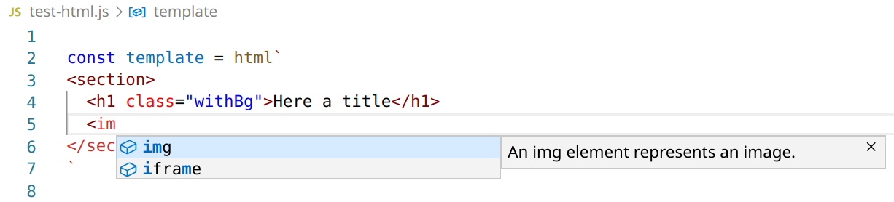

# VS Code Plugin: enhancedjs.html-in-template-string

Syntax highlighting and IntelliSense for html inside of JavaScript and TypeScript with tagged template strings.



Supported tags for template strings:

* `html`;
* `vueTemplate`;
* `handledom`.

Notice: This is a fork of [vscode-lit-html](https://github.com/mjbvz/vscode-lit-html), the purpose is to support HTML for template engines like Vue, Handledom or just plain text HTML.

## Install

Inside VSCode, press `Ctrl+P`, and enter:

```
ext install enhancedjs.html-in-template-string
```

It should be the top result.

[[Marketplace](https://marketplace.visualstudio.com/items?itemName=enhancedjs.html-in-template-string)]
